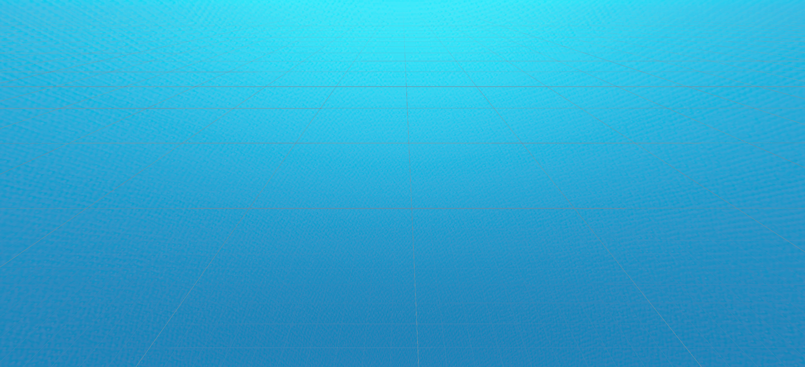

# Procedural Generation

A procedural voxel terrain system built with Unity, C#, and Unity DOTS. Focused on performance and scalable world generation.

  
  

> **Note:** Recorded in the Unity Editor. Standalone builds run much faster.

## Features

- Unity DOTS / ECS
- Procedural terrain generation
- Chunk-based mesh generation
- Multithreaded generation with Jobs + Burst
- Runtime chunk loading/unloading
- Ambient occlusion
- Physics collision
 
> Check out the [documentation](docs) for more details about the project's implementation.
